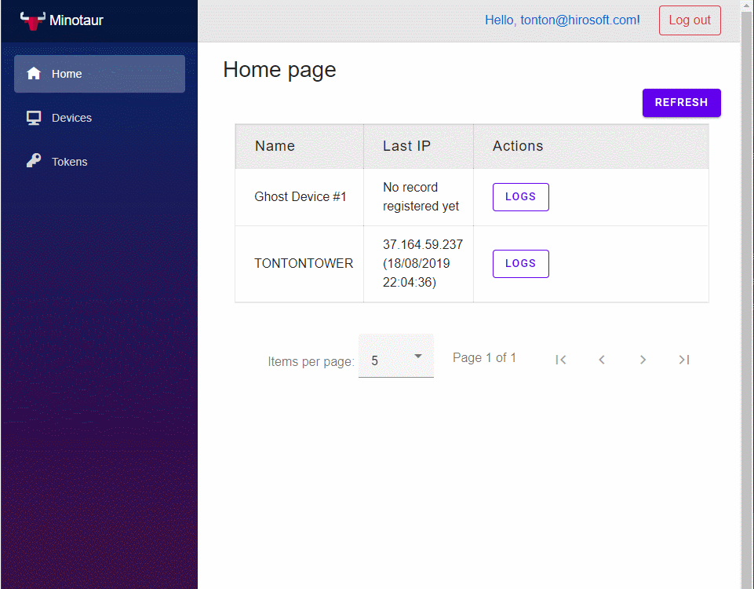
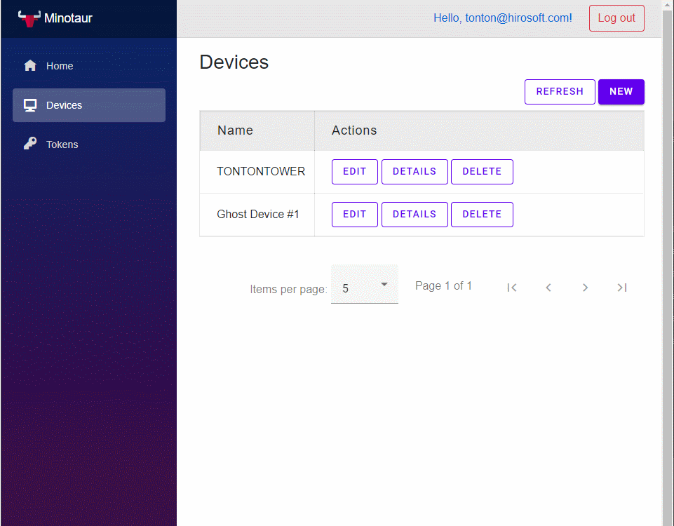
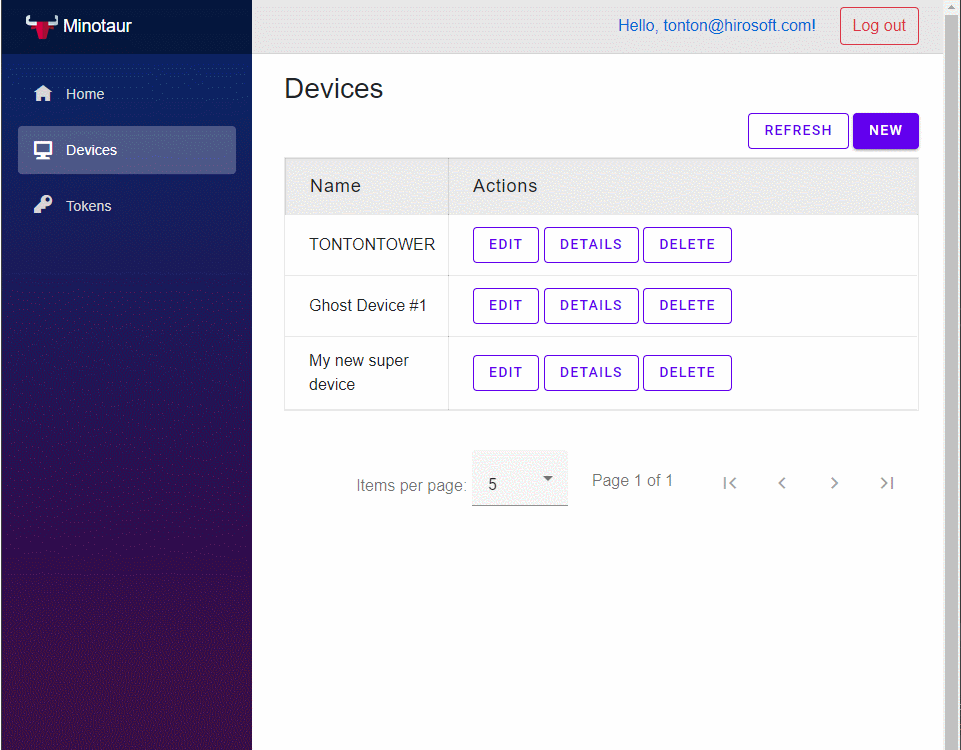
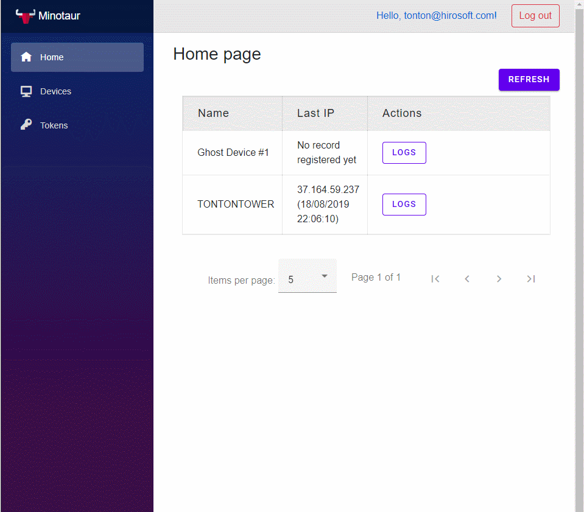

#  Minotaur (server-side) 

## Description
Minotaur is server-side blazor application which monitor your device.
This project was made for blazor experimentations & and was design first for getting IP Address from device.

## What

### Front
- [MatBlazor](https://www.matblazor.com/)
- [Bootstrap](https://getbootstrap.com/)
- [Open-Ionic](https://useiconic.com/open)

### Back
- Sqlite
- Entity Framework Core
- Rest WebAPI (for device) / JWT
- Repositories (for server-side app)
  
### DeviceService
Deviceservice is the .net core app which use on device you need to monitor.
The service will request token, register device & and post data to the API.
The `appsettings.json` need to be update with your own data like username/password & server-addr(corresponding to api url):
```json
{
/*Some code here*/
  "login": {
    "username": "tonton@hirosoft.com",
    "password": "P@$$word75"
  },
  "server-addrr": "https://localhost:44307/api/",
  "Delay": 30
}
```
The `WebMinotaur` should be launched with the good url defined on `DeviceService`.
The service use `Ipify` library for getting is own public IP Address before he send it to the server.
### Future
- [ ] Handle Validation form
- [ ] Make app S.O.L.I.D
- [ ] Contenerize each layer (API & FRONT)
- [ ] Adding more data to send to the server from device
- [ ] Handle Adding realtime data
- [ ] Graphs
- [ ] Dashboard

## Captures

Main:


Adding new device:


Deleting device


Logs:


Device service:


## Credits

Icon minotaur was modified , original author [Freepik](https://www.flaticon.com/authors/freepik)


<div>Icons made by <a href="https://www.flaticon.com/authors/freepik" title="Freepik">Freepik</a> from <a href="https://www.flaticon.com/"             title="Flaticon">www.flaticon.com</a> is licensed by <a href="http://creativecommons.org/licenses/by/3.0/"             title="Creative Commons BY 3.0" target="_blank">CC 3.0 BY</a></div>